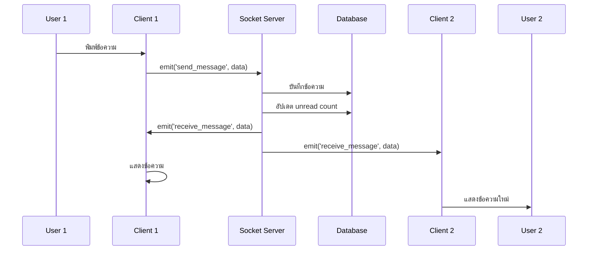
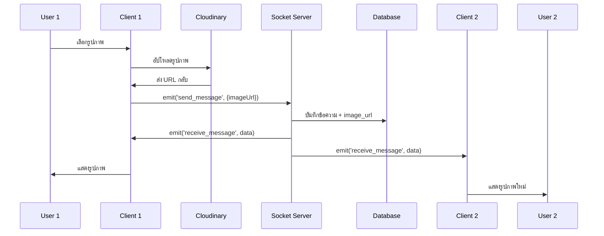
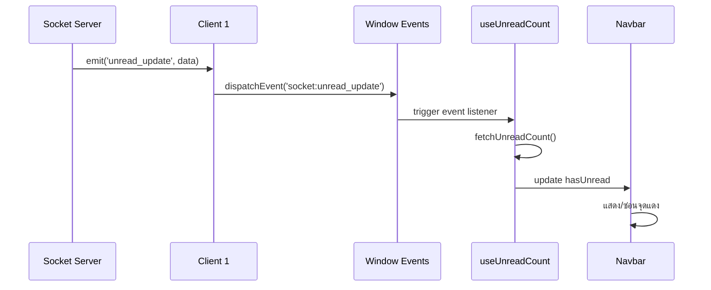
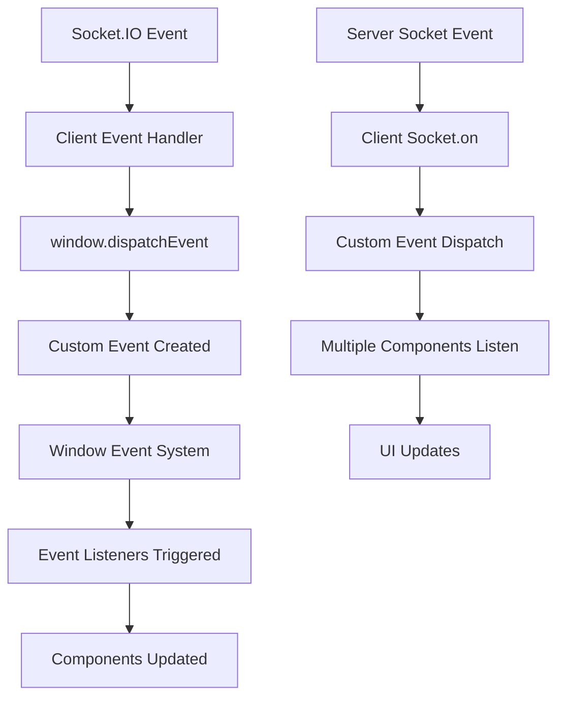

# 📱 ระบบแชท Pet Sitter App - คู่มือฉบับสมบูรณ์

## 🎯 สารบัญ
1. [ภาพรวมระบบ](#ภาพรวมระบบ)
2. [Custom Events คืออะไร](#custom-events-คืออะไร)
3. [Socket.IO Events](#socketio-events)
4. [สถาปัตยกรรมระบบ](#สถาปัตยกรรมระบบ)
5. [ไฟล์และ Components](#ไฟล์และ-components)
6. [Database Schema](#database-schema)
7. [API Endpoints](#api-endpoints)
8. [การทำงานของระบบ](#การทำงานของระบบ)
9. [Custom Events ทำงานอย่างไร](#custom-events-ทำงานอย่างไร)
10. [ตัวอย่างการใช้งาน](#ตัวอย่างการใช้งาน)

---

## 🎯 ภาพรวมระบบ

ระบบแชท Pet Sitter App เป็นระบบแชทแบบ real-time ที่ใช้ Socket.IO สำหรับการสื่อสารแบบสองทิศทาง และ Cloudinary สำหรับการอัปโหลดรูปภาพ

### ✨ ฟีเจอร์หลัก
- 💬 **แชทข้อความ** - ส่งและรับข้อความแบบ real-time
- 🖼️ **แชทรูปภาพ** - อัปโหลดและส่งรูปภาพ
- 👥 **สถานะออนไลน์** - ดูว่าใครออนไลน์อยู่
- 🔔 **แจ้งเตือน** - จุดแดงแสดงข้อความที่ยังไม่ได้อ่าน
- 👁️ **ซ่อนแชท** - ซ่อนแชทที่ไม่ต้องการเห็น
- 📱 **Responsive** - ใช้งานได้ทั้งมือถือและเดสก์ท็อป

---

## 🔄 Custom Events คืออะไร

### 🤔 Custom Events คืออะไร?
Custom Events เป็นกลไกการสื่อสารระหว่าง Components ใน React โดยไม่ต้องผ่าน Props หรือ Context

### 📋 ทำไมต้องใช้ Custom Events?

**ปัญหาของการสื่อสารแบบปกติ:**
```typescript
// ❌ ปัญหา: Props drilling
<Parent>
  <Child data={data} />
  <AnotherChild data={data} /> // ต้องส่ง data ซ้ำ
</Parent>

// ❌ ปัญหา: Context ต้อง wrap ทั้งแอป
<SocketContext>
  <EntireApp /> // ทุก component ต้องอยู่ใน context
</SocketContext>
```

**วิธีแก้ด้วย Custom Events:**
```typescript
// ✅ วิธีแก้: Custom Events
// Component A
window.dispatchEvent(new CustomEvent('socket:message', { detail: data }));

// Component B (ที่ไหนก็ได้)
window.addEventListener('socket:message', (event) => {
  console.log(event.detail); // ได้ข้อมูลทันที
});
```

### 🎯 ประโยชน์ของ Custom Events
1. **Loose Coupling** - Components ไม่ต้องรู้จักกัน
2. **Global Communication** - ส่งข้อมูลไปไหนก็ได้
3. **Easy to Debug** - ดู events ใน DevTools ได้
4. **Flexible** - เพิ่ม/ลบ listeners ได้ง่าย

---

## 🔌 Socket.IO Events

### 📡 Client-to-Server Events (ส่งจาก Client ไป Server)

#### 1. `join_app`
```typescript
// Client ส่ง
socket.emit('join_app', userId);

// Server รับ
socket.on('join_app', async (userId: string) => {
  // จัดการการเข้าสู่แอป
});
```
**หน้าที่:** แจ้งให้ Server รู้ว่าผู้ใช้เข้าสู่แอป

#### 2. `send_message`
```typescript
// Client ส่ง
socket.emit('send_message', {
  chatId: 123,
  senderId: 'user1',
  receiverId: 'user2',
  content: 'สวัสดี',
  messageType: 'TEXT',
  imageUrl: 'https://...' // ถ้าเป็นรูปภาพ
});

// Server รับ
socket.on('send_message', async (data: SendMessageData) => {
  // จัดการการส่งข้อความ
});
```
**หน้าที่:** ส่งข้อความไปยังผู้ใช้คนอื่น

#### 3. `set_current_chat`
```typescript
// Client ส่ง
socket.emit('set_current_chat', {
  userId: 'user1',
  chatId: 123
});

// Server รับ
socket.on('set_current_chat', (data) => {
  // บันทึกว่าผู้ใช้กำลังดู chat ไหนอยู่
});
```
**หน้าที่:** บันทึกว่าผู้ใช้กำลังดูแชทไหนอยู่

### 📡 Server-to-Client Events (ส่งจาก Server ไป Client)

#### 1. `receive_message`
```typescript
// Server ส่ง
io.to(receiverId).emit('receive_message', {
  id: 'msg123',
  chatId: 123,
  senderId: 'user1',
  content: 'สวัสดี',
  messageType: 'TEXT',
  timestamp: new Date(),
  senderName: 'John',
  senderProfileImage: 'avatar.jpg'
});

// Client รับ
socket.on('receive_message', (message) => {
  // แสดงข้อความใหม่
});
```
**หน้าที่:** แจ้งให้ผู้รับทราบว่ามีข้อความใหม่

#### 2. `unread_update`
```typescript
// Server ส่ง
io.to(userId).emit('unread_update', {
  chatId: 123,
  newUnreadCount: 5
});

// Client รับ
socket.on('unread_update', (data) => {
  // อัปเดตจำนวนข้อความที่ยังไม่ได้อ่าน
});
```
**หน้าที่:** อัปเดตจำนวนข้อความที่ยังไม่ได้อ่าน

#### 3. `user_online` / `user_offline`
```typescript
// Server ส่ง
io.emit('user_online', 'user123');
io.emit('user_offline', 'user123');

// Client รับ
socket.on('user_online', (userId) => {
  // แสดงสถานะออนไลน์
});
socket.on('user_offline', (userId) => {
  // ซ่อนสถานะออนไลน์
});
```
**หน้าที่:** แจ้งสถานะออนไลน์/ออฟไลน์ของผู้ใช้

#### 4. `chat_list_update`
```typescript
// Server ส่ง
io.to(userId).emit('chat_list_update', {
  chatId: 123,
  action: 'show' // หรือ 'hide'
});

// Client รับ
socket.on('chat_list_update', (data) => {
  // อัปเดต chat list
});
```
**หน้าที่:** แจ้งให้อัปเดต chat list (เช่น เมื่อ chat ที่ซ่อนไว้มีข้อความใหม่)

---

## 🏗️ สถาปัตยกรรมระบบ

```
┌─────────────────┐    ┌─────────────────┐    ┌─────────────────┐
│   Frontend      │    │   Socket.IO     │    │   Database      │
│   (React)       │◄──►│   Server        │◄──►│   (PostgreSQL)  │
└─────────────────┘    └─────────────────┘    └─────────────────┘
         │                       │                       │
         ▼                       ▼                       ▼
┌─────────────────┐    ┌─────────────────┐    ┌─────────────────┐
│ Custom Events   │    │ Real-time       │    │ Data Storage    │
│ (Window Events) │    │ Communication   │    │ (Messages,      │
│                 │    │                 │    │  Users, Chats)  │
└─────────────────┘    └─────────────────┘    └─────────────────┘
         │                       │                       │
         ▼                       ▼                       ▼
┌─────────────────┐    ┌─────────────────┐    ┌─────────────────┐
│ UI Components   │    │ Event Handlers  │    │ API Endpoints   │
│ (ChatWidget,    │    │ (Message,       │    │ (CRUD, Auth)    │
│  ChatBubble)    │    │  Presence)      │    │                 │
└─────────────────┘    └─────────────────┘    └─────────────────┘
```

### 🔄 การไหลของข้อมูล

1. **User Action** → Component Event Handler
2. **Component** → Socket.IO Client Event
3. **Socket.IO Client** → Socket.IO Server
4. **Server** → Database (บันทึกข้อมูล)
5. **Server** → Socket.IO Client (ส่ง event กลับ)
6. **Client** → Custom Event (ส่งข้อมูลไปยัง components)
7. **Components** → UI Update

---

## 📁 ไฟล์และ Components

### 🎯 Core Chat Components

#### 1. `src/components/widgets/ChatWidget.tsx`
**หน้าที่:** Component หลักที่จัดการแชททั้งหมด
```typescript
// หน้าที่หลัก
- จัดการ chat list
- จัดการการส่งข้อความ
- จัดการการซ่อนแชท
- จัดการการเลือกแชท
- เชื่อมต่อ Socket.IO

// Key Functions
- fetchChats() // ดึงรายการแชท
- handleSendMessage() // ส่งข้อความ
- handleChatSelect() // เลือกแชท
- handleHideChat() // ซ่อนแชท
```

#### 2. `src/components/chat/ChatContainer.tsx`
**หน้าที่:** แสดงข้อความและจัดการการส่งข้อความ
```typescript
// หน้าที่หลัก
- แสดงข้อความในแชท
- จัดการการส่งข้อความ (ข้อความ + รูปภาพ)
- จัดการการแสดงเวลาแบบ conditional
- จัดการการซ่อนแชท

// Key Functions
- handleSendMessage() // ส่งข้อความ
- handleImageUpload() // อัปโหลดรูปภาพ
- shouldShowTimestamp() // ตรวจสอบการแสดงเวลา
- formatTimestamp() // จัดรูปแบบเวลา
```

#### 3. `src/components/chat/ChatList.tsx`
**หน้าที่:** แสดงรายการแชท
```typescript
// หน้าที่หลัก
- แสดงรายการแชท
- แสดงสถานะออนไลน์
- แสดงจำนวนข้อความที่ยังไม่ได้อ่าน
- จัดการการเลือกแชท

// Key Features
- Online indicators (จุดเขียว)
- Unread count badges (จุดแดง)
- Relative timestamps (เช่น "5 minutes ago")
```

#### 4. `src/components/chat/ChatBubble.tsx`
**หน้าที่:** แสดงข้อความแต่ละข้อความ
```typescript
// หน้าที่หลัก
- แสดงข้อความข้อความ
- แสดงรูปภาพ
- แสดงเวลา (conditional)
- จัดรูปแบบตามผู้ส่ง

// Key Features
- รองรับข้อความและรูปภาพ
- แสดงเวลาแบบ conditional (เหมือน Facebook)
- Avatar และชื่อผู้ส่ง
```

#### 5. `src/components/chat/SocketProvider.tsx`
**หน้าที่:** จัดการ Socket.IO connection และ events
```typescript
// หน้าที่หลัก
- จัดการ Socket.IO connection
- จัดการ custom events
- จัดการ online users
- จัดการ unread updates

// Key Features
- Socket.IO connection management
- Custom event dispatching
- Online users tracking
- Real-time updates
```

### 🔧 Hooks

#### 1. `src/hooks/useSocket.ts`
```typescript
// หน้าที่
- จัดการ Socket.IO connection
- ติดตาม connection status
- จัดการ reconnection
- จัดการ page visibility

// Return Values
{
  socket, // Socket.IO instance
  isConnected, // Connection status
  isLoading, // Loading state
  isAuthenticated, // Auth status
  userId // Current user ID
}
```

#### 2. `src/hooks/useUnreadCount.ts`
```typescript
// หน้าที่
- ดึงจำนวนข้อความที่ยังไม่ได้อ่าน
- อัปเดตแบบ real-time
- จัดการ custom events

// Return Values
{
  unreadCount, // จำนวนข้อความที่ยังไม่ได้อ่าน
  loading, // Loading state
  hasUnread, // มีข้อความที่ยังไม่ได้อ่านหรือไม่
  refreshUnreadCount // ฟังก์ชันรีเฟรช
}
```

#### 3. `src/hooks/useCreateChat.ts`
```typescript
// หน้าที่
- สร้างแชทใหม่
- นำทางไปยังแชท
- จัดการแชทที่มีอยู่แล้ว

// Features
- สร้างแชทใหม่หรือใช้แชทที่มีอยู่
- นำทางไปยังหน้าแชท
- จัดการ hidden chats
```

### 🌐 API Endpoints

#### 1. `src/pages/api/chat/socket.ts`
**หน้าที่:** Socket.IO Server
```typescript
// Socket Events
- join_app // ผู้ใช้เข้าสู่แอป
- send_message // ส่งข้อความ
- set_current_chat // บันทึกแชทที่กำลังดู
- disconnect // ผู้ใช้ออกจากแอป

// Features
- Real-time messaging
- Presence management
- Unread count tracking
- Chat list updates
```

#### 2. `src/pages/api/chat/list.ts`
**หน้าที่:** ดึงรายการแชท
```typescript
// GET /api/chat/list?userId=123
// Response
{
  success: true,
  chats: [
    {
      id: 1,
      user1: { id: 1, name: 'John' },
      user2: { id: 2, name: 'Jane' },
      last_message: { content: 'สวัสดี', timestamp: '2024-01-01' },
      unread_count: 3,
      updated_at: '2024-01-01'
    }
  ]
}

// Features
- เรียงลำดับตาม updated_at
- แสดงข้อความล่าสุด
- แสดงจำนวนข้อความที่ยังไม่ได้อ่าน
- จัดการ hidden chats
```

#### 3. `src/pages/api/chat/[chatId]/message.ts`
**หน้าที่:** ดึงข้อความในแชท
```typescript
// GET /api/chat/123/message?userId=456
// Response
{
  success: true,
  messages: [
    {
      id: 1,
      content: 'สวัสดี',
      message_type: 'TEXT',
      image_url: null,
      timestamp: '2024-01-01T10:00:00Z',
      sender: { name: 'John', profile_image: 'avatar.jpg' }
    }
  ]
}

// Features
- เรียงลำดับตาม timestamp
- แสดงข้อมูลผู้ส่ง
- รองรับข้อความและรูปภาพ
```

#### 4. `src/pages/api/chat/create.ts`
**หน้าที่:** สร้างแชทใหม่
```typescript
// POST /api/chat/create
// Body: { userId: '123', targetUserId: '456' }
// Response
{
  success: true,
  chatId: 789,
  isNewChat: false,
  message: 'Chat already exists and unhidden'
}

// Features
- สร้างแชทใหม่หรือใช้แชทที่มีอยู่
- จัดการ hidden chats
- อัปเดต timestamp
```

#### 5. `src/pages/api/chat/hide.ts`
**หน้าที่:** ซ่อนแชท
```typescript
// POST /api/chat/hide
// Body: { chatId: 123, userId: '456' }
// Response
{
  success: true,
  message: 'Chat hidden successfully'
}

// Features
- ซ่อนแชทสำหรับผู้ใช้เฉพาะ
- รีเซ็ต unread count
- ไม่ลบข้อมูลจริง
```

#### 6. `src/pages/api/chat/mark-read.ts`
**หน้าที่:** ทำเครื่องหมายว่าอ่านแล้ว
```typescript
// POST /api/chat/mark-read
// Body: { chatId: 123, userId: '456' }
// Response
{
  success: true,
  message: 'Chat marked as read'
}

// Features
- รีเซ็ต unread count เป็น 0
- อัปเดต last read timestamp
```

#### 7. `src/pages/api/chat/unread-count.ts`
**หน้าที่:** ดึงจำนวนข้อความที่ยังไม่ได้อ่านทั้งหมด
```typescript
// GET /api/chat/unread-count?userId=123
// Response
{
  success: true,
  totalUnreadCount: 5,
  message: 'Unread count fetched successfully'
}

// Features
- รวมจำนวนข้อความที่ยังไม่ได้อ่านจากทุกแชท
- ไม่นับแชทที่ซ่อนไว้
```

#### 8. `src/pages/api/chat/online-users.ts`
**หน้าที่:** ดึงรายการผู้ใช้ที่ออนไลน์
```typescript
// GET /api/chat/online-users
// Response
{
  success: true,
  onlineUsers: ['123', '456', '789']
}

// Features
- แสดงรายการผู้ใช้ที่ออนไลน์
- ใช้สำหรับแสดงสถานะออนไลน์
```

### 🔧 Utilities

#### 1. `src/utils/socket.ts`
**หน้าที่:** จัดการ Socket.IO Client
```typescript
// Functions
- connectSocket(userId) // เชื่อมต่อ Socket.IO
- disconnectSocket() // ตัดการเชื่อมต่อ
- sendMessage(data) // ส่งข้อความ
- initVisibilityListener() // จัดการ page visibility

// Features
- Auto-reconnection
- Connection status tracking
- Custom event dispatching
- Page visibility handling
```

---

## 🗄️ Database Schema

### 📊 Tables

#### 1. `user` Table
```sql
CREATE TABLE user (
  id SERIAL PRIMARY KEY,
  name VARCHAR(100),
  email VARCHAR(100) UNIQUE,
  password VARCHAR(255),
  phone VARCHAR(20),
  profile_image VARCHAR(255),
  profile_image_public_id VARCHAR(255),
  is_online BOOLEAN DEFAULT false,
  last_seen TIMESTAMP DEFAULT now(),
  created_at TIMESTAMP DEFAULT now(),
  updated_at TIMESTAMP DEFAULT now()
);
```

#### 2. `chat` Table
```sql
CREATE TABLE chat (
  id SERIAL PRIMARY KEY,
  user1_id INTEGER REFERENCES user(id),
  user2_id INTEGER REFERENCES user(id),
  last_message_id INTEGER REFERENCES message(id),
  created_at TIMESTAMP DEFAULT now(),
  updated_at TIMESTAMP DEFAULT now()
);
```

#### 3. `message` Table
```sql
CREATE TABLE message (
  id SERIAL PRIMARY KEY,
  chat_id INTEGER REFERENCES chat(id),
  sender_id INTEGER REFERENCES user(id),
  message_type VARCHAR(10) DEFAULT 'TEXT',
  content TEXT,
  image_url VARCHAR(255),
  timestamp TIMESTAMP DEFAULT now(),
  is_read BOOLEAN DEFAULT false
);
```

#### 4. `user_chat_settings` Table
```sql
CREATE TABLE user_chat_settings (
  id SERIAL PRIMARY KEY,
  user_id INTEGER REFERENCES user(id),
  chat_id INTEGER REFERENCES chat(id),
  is_hidden BOOLEAN DEFAULT false,
  unread_count INTEGER DEFAULT 0,
  UNIQUE(user_id, chat_id)
);
```

---

## 🔄 การทำงานของระบบ

### 📱 การส่งข้อความ



### 🖼️ การส่งรูปภาพ



### 🔔 การแจ้งเตือน



---

## 🎯 Custom Events ทำงานอย่างไร

### 🔍 Custom Events Flow



### 📋 Custom Events ที่ใช้ในระบบ

#### 1. `socket:receive_message`
```typescript
// ใน socket.ts (Client)
socket.on('receive_message', (message) => {
  console.log('Received message:', message);
  // ส่ง custom event
  window.dispatchEvent(new CustomEvent('socket:receive_message', { 
    detail: message 
  }));
});

// ใน SocketProvider.tsx
window.addEventListener('socket:receive_message', (event: CustomEvent) => {
  const message = event.detail;
  console.log('Received message via custom event:', message);
  setMessages(prev => [...prev, message]);
});
```

#### 2. `socket:unread_update`
```typescript
// ใน socket.ts (Client)
socket.on('unread_update', (data) => {
  console.log('Unread update:', data);
  window.dispatchEvent(new CustomEvent('socket:unread_update', { 
    detail: data 
  }));
});

// ใน useUnreadCount.ts
window.addEventListener('socket:unread_update', (event: CustomEvent) => {
  const data = event.detail;
  console.log('Received unread_update in navbar via custom event:', data);
  fetchUnreadCount(); // ดึงข้อมูลใหม่จาก API
});
```

#### 3. `socket:user_online`
```typescript
// ใน socket.ts (Client)
socket.on('user_online', (userId) => {
  console.log('User online:', userId);
  window.dispatchEvent(new CustomEvent('socket:user_online', { 
    detail: userId 
  }));
});

// ใน SocketProvider.tsx
window.addEventListener('socket:user_online', (event: CustomEvent) => {
  const userId = event.detail;
  setOnlineUsers(prev => {
    if (!prev.includes(userId)) {
      return [...prev, userId];
    }
    return prev;
  });
});
```

#### 4. `socket:chat_list_update`
```typescript
// ใน socket.ts (Client)
socket.on('chat_list_update', (data) => {
  console.log('Chat list update:', data);
  window.dispatchEvent(new CustomEvent('socket:chat_list_update', { 
    detail: data 
  }));
});

// ใน SocketProvider.tsx
window.addEventListener('socket:chat_list_update', (event: CustomEvent) => {
  const data = event.detail;
  // ส่ง event ไปให้ ChatWidget เพื่อ refresh chat list
  window.dispatchEvent(new CustomEvent('refresh_chat_list', { detail: data }));
});
```

### 🎯 ตัวอย่างการทำงานของ Custom Events

#### 📝 สถานการณ์: ผู้ใช้ A ส่งข้อความให้ผู้ใช้ B

1. **Server ส่ง Socket Event:**
```typescript
// ใน socket.ts (Server)
io.to(receiverId).emit('receive_message', {
  id: 'msg123',
  chatId: 123,
  senderId: 'user1',
  content: 'สวัสดี',
  messageType: 'TEXT',
  timestamp: new Date()
});
```

2. **Client รับ Socket Event:**
```typescript
// ใน socket.ts (Client)
socket.on('receive_message', (message) => {
  console.log('Received message:', message);
  // ส่ง custom event
  window.dispatchEvent(new CustomEvent('socket:receive_message', { 
    detail: message 
  }));
});
```

3. **Components รับ Custom Event:**
```typescript
// ใน SocketProvider.tsx
window.addEventListener('socket:receive_message', (event: CustomEvent) => {
  const message = event.detail;
  setMessages(prev => [...prev, message]); // อัปเดต messages
});

// ใน useUnreadCount.ts
window.addEventListener('socket:receive_message', (event: CustomEvent) => {
  const message = event.detail;
  fetchUnreadCount(); // อัปเดต unread count
});
```

4. **UI อัปเดต:**
- ChatBubble แสดงข้อความใหม่
- Navbar แสดงจุดแดง
- ChatList อัปเดต unread count

---

## 💡 ตัวอย่างการใช้งาน

### 🚀 การเริ่มต้นใช้งาน

#### 1. **ติดตั้ง Dependencies**
```bash
npm install socket.io socket.io-client
```

#### 2. **สร้าง Socket.IO Server**
```typescript
// pages/api/chat/socket.ts
import { Server } from 'socket.io';

export default function handler(req, res) {
  if (!res.socket.server.io) {
    const io = new Server(res.socket.server, {
      path: '/api/chat/socket',
      cors: { origin: '*' }
    });

    io.on('connection', (socket) => {
      socket.on('join_app', (userId) => {
        // จัดการการเข้าสู่แอป
      });
    });

    res.socket.server.io = io;
  }
  res.end();
}
```

#### 3. **สร้าง Socket.IO Client**
```typescript
// utils/socket.ts
import { io } from 'socket.io-client';

export const connectSocket = (userId: string) => {
  const socket = io('/api/chat/socket');
  
  socket.on('connect', () => {
    socket.emit('join_app', userId);
  });

  return socket;
};
```

#### 4. **สร้าง Custom Event System**
```typescript
// utils/socket.ts
socket.on('receive_message', (message) => {
  window.dispatchEvent(new CustomEvent('socket:receive_message', { 
    detail: message 
  }));
});
```

#### 5. **ใช้ใน Components**
```typescript
// components/chat/ChatWidget.tsx
useEffect(() => {
  const handleMessage = (event: CustomEvent) => {
    const message = event.detail;
    setMessages(prev => [...prev, message]);
  };

  window.addEventListener('socket:receive_message', handleMessage);
  
  return () => {
    window.removeEventListener('socket:receive_message', handleMessage);
  };
}, []);
```

### 🔧 การเพิ่มฟีเจอร์ใหม่

#### ตัวอย่าง: เพิ่มฟีเจอร์ Typing Indicator

1. **เพิ่ม Socket Event Type:**
```typescript
// types/socket.types.ts
export interface SocketEvents {
  typing_start: (data: { chatId: number, userId: string }) => void;
  typing_stop: (data: { chatId: number, userId: string }) => void;
}
```

2. **เพิ่ม Server Handler:**
```typescript
// pages/api/chat/socket.ts
socket.on('typing_start', (data) => {
  socket.to(data.chatId.toString()).emit('typing_start', data);
});
```

3. **เพิ่ม Client Handler:**
```typescript
// utils/socket.ts
socket.on('typing_start', (data) => {
  window.dispatchEvent(new CustomEvent('socket:typing_start', { 
    detail: data 
  }));
});
```

4. **ใช้ใน Component:**
```typescript
// components/chat/ChatContainer.tsx
useEffect(() => {
  const handleTyping = (event: CustomEvent) => {
    const { userId } = event.detail;
    setTypingUsers(prev => [...prev, userId]);
  };

  window.addEventListener('socket:typing_start', handleTyping);
  return () => window.removeEventListener('socket:typing_start', handleTyping);
}, []);
```

---

## 🎯 สรุป

### ✨ จุดเด่นของระบบ

1. **Real-time Communication** - ใช้ Socket.IO สำหรับการสื่อสารแบบ real-time
2. **Custom Events** - ใช้ Custom Events สำหรับการสื่อสารระหว่าง Components
3. **Modular Architecture** - แยก Components และ Hooks ชัดเจน
4. **Image Support** - รองรับการส่งรูปภาพผ่าน Cloudinary
5. **Unread Tracking** - ติดตามข้อความที่ยังไม่ได้อ่าน
6. **Online Presence** - แสดงสถานะออนไลน์
7. **Hide/Show Chats** - สามารถซ่อน/แสดงแชทได้

### 🔧 เทคโนโลยีที่ใช้

- **Frontend:** React, TypeScript, Next.js
- **Real-time:** Socket.IO
- **Database:** PostgreSQL, Prisma ORM
- **Image Storage:** Cloudinary
- **Styling:** Tailwind CSS

### 📚 การเรียนรู้เพิ่มเติม

1. **Socket.IO Documentation** - https://socket.io/docs/
2. **React Custom Events** - https://developer.mozilla.org/en-US/docs/Web/API/CustomEvent
3. **Prisma Documentation** - https://www.prisma.io/docs/
4. **Cloudinary Documentation** - https://cloudinary.com/documentation

---

*เอกสารนี้เขียนขึ้นเพื่อช่วยให้ผู้ที่เพิ่งเริ่มเรียนรู้ Socket.IO และ Custom Events สามารถเข้าใจระบบแชท Pet Sitter App ได้อย่างครบถ้วน 🚀*